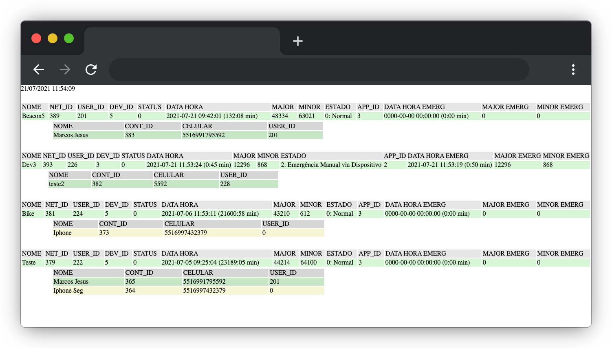

<!-- 
[Acessar Servidor :fontawesome-solid-paper-plane:](#https://www.segcontrole.com.br/safer/v1/verificar_redes.php){:target="_blank" .mdc-button mdc-button--outlined }  -->

<a href="https://www.segcontrole.com.br/safer/v1/verificar_redes.php" target="_blank">
Acessar Servidor :fontawesome-solid-paper-plane:
</a>

---

URL que executa o servidor web temporário. Para que ocorra os cálculos de tempos, disparo de emergências, é necessário deixar esse servidor executando em uma máquina. Além de ter essa função, através dessa URL também é possivel acompanhar os estados de cada rede de monitoramento e todos os seus detalhes.

```
https://www.segcontrole.com.br/safer/v1/verificar_redes.php
```


<!--  -->


